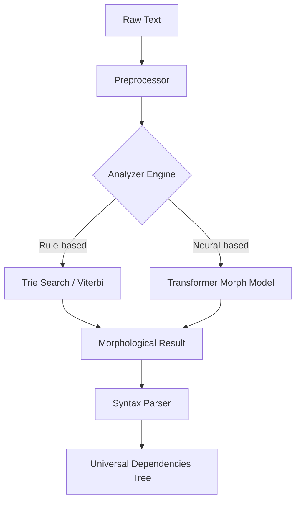

# KULIM Grammar

<p align="center">
  
  
  
  <a href="README.md"></a>
</p>

---

## Overview

**KULIM Grammar** is the core analysis engine of the KULIM framework.
By employing a hybrid architecture that combines the precision of a rule-based engine with the flexibility of a neural model, it delivers uncompromising performance in Korean morphological analysis and dependency parsing.

### Why Grammar?

- **Hybrid Tagging**: Combines the Viterbi algorithm with Transformer models for robust and precise tagging, even with Out-Of-Vocabulary (OOV) words.
- **Extreme Performance**: The core Trie data structure is implemented in Rust, achieving search speeds 10–50x faster than pure Python modules.
- **Production Ready**: Guaranteed stability for enterprise environments through enhanced exception handling and a standardized logging system.

---

## Architecture



---

## Installation

```bash
# Install the unified KULIM package
pip install kulim

# If GPU acceleration is required (based on CUDA 12.x)
pip install cupy-cuda12x
```

> [!TIP]
> For optimal performance, we recommend building the [Rust extension module](rust/) directly from source.

---

## CLI Tool Guide

KULIM Grammar provides an intuitive Command Line Interface.

### 1. Sentence Analysis (Analyze)

```bash
# Basic analysis command
uv run grammar analyze "Today's weather is really nice."

# Apply all acceleration options
uv run grammar analyze "Nice to meet you" --rust --neural --gpu
```

### 2. Model Training (Train)

```bash
# Train the engine using a CoNLL-U corpus
uv run grammar train ./corpus_data/ --epochs 10 --batch-size 32
```

---

## API Reference

### `MorphAnalyzer`

The main interface for morphological analysis.

| Method                    | Description                                                                |
| :------------------------ | :------------------------------------------------------------------------- |
| `analyze(text)`           | Analyzes text and returns a list of `Morph` objects.                       |
| `train(sentence, morphs)` | Real-time updates the model with analysis results for a specific sentence. |
| `save()`                  | Permanently saves trained dictionaries and model weights.                  |

### `SyntaxAnalyzer`

Performs dependency parsing and identifies sentence components.

| Method                          | Description                                                                          |
| :------------------------------ | :----------------------------------------------------------------------------------- |
| `analyze(text, morph_analyzer)` | Extracts components by analyzing governor-dependent relationships within a sentence. |

---

## Troubleshooting

| Error                | Cause                             | Solution                                                   |
| :------------------- | :-------------------------------- | :--------------------------------------------------------- |
| `DictionaryError`    | Dictionary data path not found    | Check the `KULIM_DATA_DIR` environment variable.           |
| `ModelLoadError`     | Failed to load neural model (.pt) | Verify the model path and file integrity.                  |
| `RustExtensionError` | Binary format mismatch            | Rebuild in your local environment using `maturin develop`. |

---

## License

This module is distributed under the [MIT License](../../LICENSE).
Please use [GitHub Issues](https://github.com/jake1104/KULIM/issues) for contributions and bug reports.
