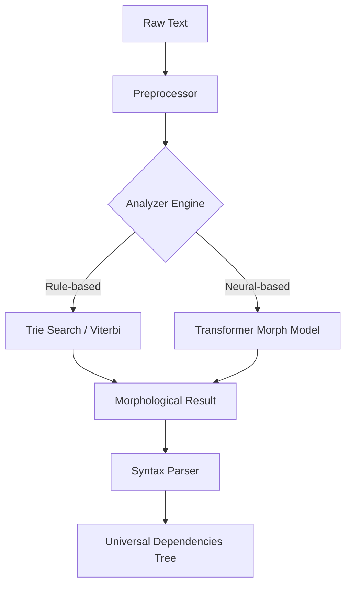

# KULIM Grammar

<p align="center">
  
  
  
  <a href="README.md"></a>
</p>

---

## Overview

**KULIM Grammar** is the core analysis engine of the KULIM framework.
Through a hybrid architecture combining the precision of rule-based engines with the flexibility of neural models, it provides uncompromising performance in Korean morphological analysis and dependency parsing.

### Why Grammar?

- **Hybrid Tagging**: Combines Viterbi algorithm and Transformer models for robust tagging that is resilient to out-of-vocabulary (OOV) words while maintaining precision
- **Extreme Performance**: Core data structure (Trie) implemented in Rust achieves approximately 10-50x faster search speed compared to pure Python modules
- **Production Ready**: Enhanced exception handling and standard logging system ensure stability in enterprise environments

---

## System Architecture



---

## Installation

```bash
# Install KULIM integrated package
pip install kulim

# For GPU acceleration (CUDA 12.x)
pip install cupy-cuda12x
```

> [!TIP]
> For optimal performance, we recommend building and using the [Rust extension module](rust/) directly.

---

## Command Line Interface

KULIM Grammar provides intuitive CLI commands.

### 1. Sentence Analysis

```bash
# Basic analysis command
uv run grammar analyze "The weather is really nice today."

# Apply all acceleration options
uv run grammar analyze "Nice to meet you" --rust --neural --gpu

# Include syntax parsing
uv run grammar analyze "Analyzing Korean language" --syntax
```

**Example Output:**

```
오늘/NNG 날씨/NNG 가/JKS 정말/MAG 좋/VA 네요/EF ./SF
```

### 2. Model Training

```bash
# Train engine using CoNLL-U corpus
uv run grammar train resource/ko_kaist-ud-train.conllu --epochs 10 --batch-size 32

# Training options
uv run grammar train <corpus_path> \
  --epochs 10 \
  --batch-size 32 \
  --learning-rate 0.001 \
  --gpu
```

### 3. Model Save and Load

```bash
# Save trained model
uv run grammar save --output ./models/my_model

# Load saved model
uv run grammar analyze "test" --model ./models/my_model
```

---

## API Reference

### `MorphAnalyzer`

Main interface for morphological analysis.

#### Initialization

```python
from grammar import MorphAnalyzer

# Basic initialization
analyzer = MorphAnalyzer()

# Enable Rust acceleration
analyzer = MorphAnalyzer(use_rust=True)

# Enable neural model
analyzer = MorphAnalyzer(use_neural=True)

# Enable all options
analyzer = MorphAnalyzer(use_rust=True, use_neural=True, use_gpu=True)
```

#### Key Methods

| Method                    | Description                                                    | Return Type   |
| :------------------------ | :------------------------------------------------------------- | :------------ |
| `analyze(text)`           | Analyze text and return list of `Morph` objects                | `list[Morph]` |
| `train(sentence, morphs)` | Apply analysis results to model in real-time (Online Learning) | `None`        |
| `save(path)`              | Permanently save learned dictionary and model weights          | `None`        |
| `load(path)`              | Load saved model                                               | `None`        |

#### Usage Example

```python
from grammar import MorphAnalyzer

# Initialize analyzer
analyzer = MorphAnalyzer(use_rust=True)

# Morphological analysis
result = analyzer.analyze("Analyzing Korean language.")
for morph in result:
    print(f"{morph.surface}/{morph.pos}")

# Output:
# 한국어/NNG
# 를/JKO
# 분석/NNG
# 하/XSV
# ㅂ니다/EF
# ./SF

# Online Learning
sentence = "This is a new word"
morphs = [
    ("새롭", "VA"),
    ("ㄴ", "ETM"),
    ("단어", "NNG"),
    ("이", "VCP"),
    ("ㅂ니다", "EF")
]
analyzer.train(sentence, morphs)

# Save model
analyzer.save("./my_model")
```

### `Morph` Class

Data class representing morphological analysis results.

| Attribute | Type  | Description                      |
| :-------- | :---- | :------------------------------- |
| `surface` | `str` | Surface form (actual text)       |
| `lemma`   | `str` | Base form (lemma)                |
| `pos`     | `str` | Part-of-speech tag               |
| `start`   | `int` | Start position (character index) |
| `end`     | `int` | End position (character index)   |

```python
morph = result[0]
print(f"Surface: {morph.surface}")
print(f"Lemma: {morph.lemma}")
print(f"POS: {morph.pos}")
print(f"Position: {morph.start}~{morph.end}")
```

### `SyntaxAnalyzer`

Performs dependency parsing and sentence component identification.

#### Initialization and Usage

```python
from grammar import MorphAnalyzer, SyntaxAnalyzer

# Use with morphological analyzer
morph_analyzer = MorphAnalyzer(use_rust=True)
syntax_analyzer = SyntaxAnalyzer()

# Syntax parsing
text = "Studying Korean language"
result = syntax_analyzer.analyze(text, morph_analyzer)

for component in result:
    print(f"{component.text} - {component.type} ({component.relation})")

# Output:
# 한국어를 - Object (obj)
# 공부합니다 - Predicate (root)
```

#### Key Methods

| Method                          | Description                                                         | Return Type       |
| :------------------------------ | :------------------------------------------------------------------ | :---------------- |
| `analyze(text, morph_analyzer)` | Analyze dependency relations within sentence and extract components | `list[Component]` |

---

## POS Tagset

KULIM Grammar is based on the Sejong POS tagset.

### Major Tags

| Tag     | Part of Speech                     | Examples                  |
| :------ | :--------------------------------- | :------------------------ |
| **NNG** | Common noun                        | person, country, book     |
| **NNP** | Proper noun                        | Seoul, Korea, Kim Cheolsu |
| **NNB** | Dependent noun                     | thing, number, place      |
| **VV**  | Verb                               | go, eat, see              |
| **VA**  | Adjective                          | good, big, pretty         |
| **MAG** | General adverb                     | very, quite, really       |
| **JKS** | Subject case marker                | i, ga                     |
| **JKO** | Object case marker                 | eul, reul                 |
| **JKB** | Adverbial case marker              | e, eseo, ro               |
| **EP**  | Pre-final ending                   | si, eot, get              |
| **EF**  | Final ending                       | da, yo, kka               |
| **ETM** | Adnominal ending                   | n, neun, l                |
| **XSV** | Verb-deriving suffix               | ha, doe, siki             |
| **SF**  | Period, question mark, exclamation | ., ?, !                   |

[View full tagset](https://www.korean.go.kr/front/etcData/etcDataView.do?mn_id=46&etc_seq=71)

---

## Advanced Usage

### 1. Batch Processing

```python
from grammar import MorphAnalyzer

analyzer = MorphAnalyzer(use_rust=True)

sentences = [
    "Hello",
    "Nice to meet you",
    "Have a good day"
]

results = [analyzer.analyze(sent) for sent in sentences]
for sent, morphs in zip(sentences, results):
    print(f"{sent}:")
    for m in morphs:
        print(f"  {m.surface}/{m.pos}")
```

### 2. Custom Dictionary Addition

```python
from grammar import MorphAnalyzer

analyzer = MorphAnalyzer()

# Add words to user dictionary
analyzer.add_word("ChatGPT", "NNP")  # Proper noun
analyzer.add_word("AI", "NNG")  # Common noun

# Analysis
result = analyzer.analyze("ChatGPT is AI")
for m in result:
    print(f"{m.surface}/{m.pos}")
```

### 3. Stopword Filtering

```python
from grammar import MorphAnalyzer

analyzer = MorphAnalyzer(use_rust=True)

# Define stopword POS tags
STOPWORD_POS = {'JKS', 'JKO', 'JKB', 'JX', 'EP', 'EF', 'ETM', 'SF'}

def extract_keywords(text):
    """Extract only keywords from text"""
    morphs = analyzer.analyze(text)
    keywords = [m.surface for m in morphs if m.pos not in STOPWORD_POS]
    return keywords

text = "Korean natural language processing is very important"
keywords = extract_keywords(text)
print(keywords)  # ['Korean', 'natural language', 'processing', 'very', 'important']
```

### 4. POS Statistics

```python
from grammar import MorphAnalyzer
from collections import Counter

analyzer = MorphAnalyzer(use_rust=True)

text = "Korean morphological analysis is the foundation of natural language processing. Accurate morphological analysis is important."
morphs = analyzer.analyze(text)

# Calculate POS frequency
pos_counter = Counter(m.pos for m in morphs)
print("POS Frequency:")
for pos, count in pos_counter.most_common():
    print(f"  {pos}: {count}")
```

---

## Performance Optimization

### Benchmark

```python
from grammar import MorphAnalyzer
import time

# Compare Rust acceleration
text = "Korean morphological analysis performance test." * 100

# Python engine
analyzer_py = MorphAnalyzer(use_rust=False)
start = time.time()
for _ in range(100):
    analyzer_py.analyze(text)
py_time = time.time() - start

# Rust engine
analyzer_rust = MorphAnalyzer(use_rust=True)
start = time.time()
for _ in range(100):
    analyzer_rust.analyze(text)
rust_time = time.time() - start

print(f"Python: {py_time:.3f}s")
print(f"Rust: {rust_time:.3f}s")
print(f"Speed improvement: {py_time/rust_time:.1f}x")
```

### Optimization Tips

1. **Enable Rust acceleration**: Use `use_rust=True` option
2. **Batch processing**: Process multiple sentences at once using list comprehension
3. **GPU utilization**: Use `use_gpu=True` option for bulk text processing
4. **Reuse models**: Reuse analyzer objects to reduce initialization overhead

---

## Troubleshooting

### Common Errors

| Error                | Cause                                  | Solution                                             |
| :------------------- | :------------------------------------- | :--------------------------------------------------- |
| `DictionaryError`    | Cannot find dictionary data path       | Check `KULIM_DATA_DIR` environment variable          |
| `ModelLoadError`     | Failed to load neural model file (.pt) | Check model path and file integrity                  |
| `RustExtensionError` | Built binary format mismatch           | Rebuild in local environment using `maturin develop` |
| `OutOfMemoryError`   | GPU memory insufficient                | Reduce batch size or use CPU mode                    |

### FAQ

**Q: Analysis results differ from expectations.**
A: You can use the Online Learning feature to tune the model for specific domains.

**Q: How do I build the Rust extension module?**
A:

```bash
cd grammar
pip install maturin
maturin develop --release
```

**Q: How long does neural model training take?**
A: Based on UD Korean Kaist dataset, approximately 10-20 minutes on GPU.

---

## License

This module is distributed under the [MIT License](../../LICENSE).
For contributions and bug reports, please use [GitHub Issues](https://github.com/jake1104/KULIM/issues).

---

<p align="center">
  Part of the KULIM Framework
</p>
