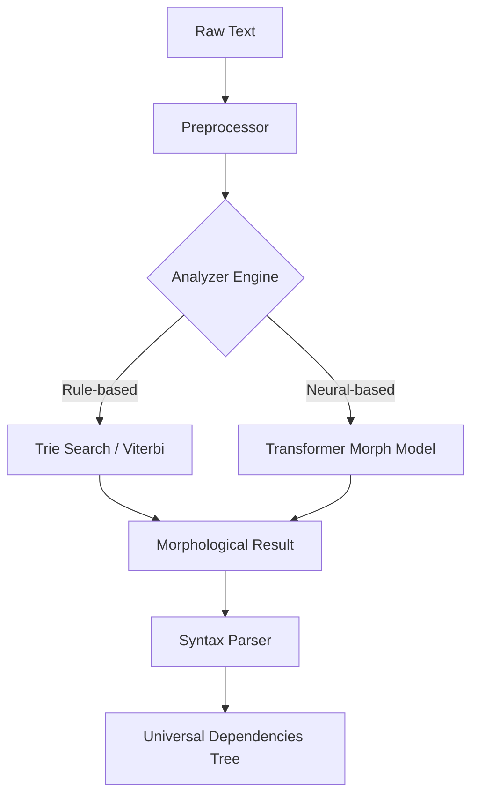

# KULIM Grammar

<p align="center">
  
  
  
  <a href="README.en.md"></a>
</p>

---

## 개요 (Overview)

**KULIM Grammar**는 KULIM 프레임워크의 핵심 분석 엔진입니다.
규칙 기반(Rule-based) 엔진의 정밀함과 신경망(Neural) 모델의 유연성을 결합한 하이브리드 아키텍처를 통해, 한국어 형태소 분석 및 의존 구문 분석에서 타협 없는 성능을 제공합니다.

### 왜 Grammar인가?

- **Hybrid Tagging**: Viterbi 알고리즘과 Transformer 모델을 결합하여 미등록 단어(OOV)에 강건하면서도 정밀한 태깅을 수행합니다.
- **Extreme Performance**: 핵심 자료구조인 Trie를 Rust로 구현하여 Python 모듈 대비 약 10~50배의 검색 속도를 확보했습니다.
- **Production Ready**: 예외 처리 강화와 표준 로깅 시스템 도입으로 엔터프라이즈 환경에서의 안정성을 보장합니다.

---

## 시스템 아키텍처 (Architecture)



---

## 설치 가이드 (Installation)

```bash
# KULIM 통합 패키지 설치
pip install kulim

# GPU 가속이 필요한 경우 (CUDA 12.x 기준)
pip install cupy-cuda12x
```

> [!TIP]
> 최상의 성능을 위해 [Rust 확장 모듈](rust/)을 직접 빌드하여 사용하는 것을 권장합니다.

---

## CLI 도구 사용법 (Command Line Interface)

KULIM Grammar는 직관적인 CLI 명령어를 제공합니다.

### 1. 문장 분석 (Analyze)

```bash
# 기본 분석 명령
uv run grammar analyze "오늘 날씨가 정말 좋네요."

# 모든 가속화 옵션 적용
uv run grammar analyze "반갑습니다" --rust --neural --gpu

# 구문 분석 포함
uv run grammar analyze "한국어를 분석합니다" --syntax
```

**출력 예시:**

```
오늘/NNG 날씨/NNG 가/JKS 정말/MAG 좋/VA 네요/EF ./SF
```

### 2. 모델 학습 (Train)

```bash
# CoNLL-U 말뭉치를 이용한 엔진 학습
uv run grammar train resource/ko_kaist-ud-train.conllu --epochs 10 --batch-size 32

# 학습 옵션
uv run grammar train <corpus_path> \
  --epochs 10 \
  --batch-size 32 \
  --learning-rate 0.001 \
  --gpu
```

### 3. 모델 저장 및 로드 (v0.1.1+)

학습된 모델을 단일 `.kg` (KULIM Grammar) 파일로 패키징할 수 있습니다.

```bash
# 모델 저장 (6개 파일 → 1개 .kg 파일)
uv run grammar save --output ./models/my_model

# 생성된 파일: ./models/my_model.kg (약 120MB)
```

**`.kg` 파일 포맷:**

- 커스텀 바이너리 포맷 (KULIM Grammar)
- 6개 모델 파일을 하나로 통합
- 헤더 + 파일 테이블 + 데이터 섹션 구조

**Python API로 저장/로드:**

```python
from grammar import MorphAnalyzer

# 모델 저장
analyzer = MorphAnalyzer()
analyzer.save_model("./models/my_model.kg")

# 모델 로드
analyzer = MorphAnalyzer.load_model("./models/my_model.kg")
result = analyzer.analyze("테스트")
```

---

## API 레퍼런스 (API Reference)

### `MorphAnalyzer`

형태소 분석을 담당하는 메인 인터페이스입니다.

#### 초기화

```python
from grammar import MorphAnalyzer

# 기본 초기화
analyzer = MorphAnalyzer()

# Rust 가속 활성화
analyzer = MorphAnalyzer(use_rust=True)

# 신경망 모델 활성화
analyzer = MorphAnalyzer(use_neural=True)

# 모든 옵션 활성화
analyzer = MorphAnalyzer(use_rust=True, use_neural=True, use_gpu=True)
```

#### 주요 메서드

| Method                    | Description                                                           | Return Type   |
| :------------------------ | :-------------------------------------------------------------------- | :------------ |
| `analyze(text)`           | 텍스트를 분석하여 `Morph` 객체 리스트를 반환                          | `list[Morph]` |
| `train(sentence, morphs)` | 특정 문장에 대한 분석 결과를 실시간으로 모델에 반영 (Online Learning) | `None`        |
| `save(path)`              | 학습된 사전 및 모델 가중치를 영구 저장                                | `None`        |
| `load(path)`              | 저장된 모델 로드                                                      | `None`        |

#### 사용 예제

```python
from grammar import MorphAnalyzer

# 분석기 초기화
analyzer = MorphAnalyzer(use_rust=True)

# 형태소 분석
result = analyzer.analyze("한국어를 분석합니다.")
for morph in result:
    print(f"{morph.surface}/{morph.pos}")

# 출력:
# 한국어/NNG
# 를/JKO
# 분석/NNG
# 하/XSV
# ㅂ니다/EF
# ./SF

# Online Learning
sentence = "새로운 단어입니다"
morphs = [
    ("새롭", "VA"),
    ("ㄴ", "ETM"),
    ("단어", "NNG"),
    ("이", "VCP"),
    ("ㅂ니다", "EF")
]
analyzer.train(sentence, morphs)

# 모델 저장 (개별 파일)
analyzer.save("./my_model")

# 모델 패키징 (단일 .kg 파일, v0.1.1+)
analyzer.save_model("./models/my_model.kg")

# 패키지에서 로드 (v0.1.1+)
analyzer = MorphAnalyzer.load_model("./models/my_model.kg", use_rust=True)
```

### `Morph` 클래스

형태소 분석 결과를 나타내는 데이터 클래스입니다.

| Attribute | Type  | Description             |
| :-------- | :---- | :---------------------- |
| `surface` | `str` | 표면형 (실제 텍스트)    |
| `lemma`   | `str` | 기본형 (원형)           |
| `pos`     | `str` | 품사 태그               |
| `start`   | `int` | 시작 위치 (문자 인덱스) |
| `end`     | `int` | 종료 위치 (문자 인덱스) |

```python
morph = result[0]
print(f"표면형: {morph.surface}")
print(f"기본형: {morph.lemma}")
print(f"품사: {morph.pos}")
print(f"위치: {morph.start}~{morph.end}")
```

### `SyntaxAnalyzer`

의존 구문 분석 및 문장 성분 판별을 수행합니다.

#### 초기화 및 사용

```python
from grammar import MorphAnalyzer, SyntaxAnalyzer

# 형태소 분석기와 함께 사용
morph_analyzer = MorphAnalyzer(use_rust=True)
syntax_analyzer = SyntaxAnalyzer()

# 구문 분석
text = "한국어를 공부합니다"
result = syntax_analyzer.analyze(text, morph_analyzer)

for component in result:
    print(f"{component.text} - {component.type} ({component.relation})")

# 출력:
# 한국어를 - 목적어 (obj)
# 공부합니다 - 서술어 (root)
```

#### 주요 메서드

| Method                          | Description                                       | Return Type       |
| :------------------------------ | :------------------------------------------------ | :---------------- |
| `analyze(text, morph_analyzer)` | 문장 내부의 지배-종속 관계를 분석하여 성분을 추출 | `list[Component]` |

---

## 품사 태그셋 (POS Tagset)

KULIM Grammar는 세종 품사 태그셋을 기반으로 합니다.

### 주요 품사

| 태그    | 품사                   | 예시               |
| :------ | :--------------------- | :----------------- |
| **NNG** | 일반 명사              | 사람, 나라, 책     |
| **NNP** | 고유 명사              | 서울, 한국, 김철수 |
| **NNB** | 의존 명사              | 것, 수, 데         |
| **VV**  | 동사                   | 가다, 먹다, 보다   |
| **VA**  | 형용사                 | 좋다, 크다, 예쁘다 |
| **MAG** | 일반 부사              | 매우, 아주, 정말   |
| **JKS** | 주격 조사              | 이, 가             |
| **JKO** | 목적격 조사            | 을, 를             |
| **JKB** | 부사격 조사            | 에, 에서, 로       |
| **EP**  | 선어말 어미            | 시, 었, 겠         |
| **EF**  | 종결 어미              | 다, 요, 까         |
| **ETM** | 관형형 전성 어미       | ㄴ, 는, ㄹ         |
| **XSV** | 동사 파생 접미사       | 하, 되, 시키       |
| **SF**  | 마침표, 물음표, 느낌표 | ., ?, !            |

[전체 태그셋 보기](https://www.korean.go.kr/front/etcData/etcDataView.do?mn_id=46&etc_seq=71)

---

## 고급 사용 예제 (Advanced Usage)

### 1. 배치 처리

```python
from grammar import MorphAnalyzer

analyzer = MorphAnalyzer(use_rust=True)

sentences = [
    "안녕하세요",
    "반갑습니다",
    "좋은 하루 되세요"
]

results = [analyzer.analyze(sent) for sent in sentences]
for sent, morphs in zip(sentences, results):
    print(f"{sent}:")
    for m in morphs:
        print(f"  {m.surface}/{m.pos}")
```

### 2. 커스텀 사전 추가

```python
from grammar import MorphAnalyzer

analyzer = MorphAnalyzer()

# 사용자 사전에 단어 추가
analyzer.add_word("챗GPT", "NNP")  # 고유명사
analyzer.add_word("인공지능", "NNG")  # 일반명사

# 분석
result = analyzer.analyze("챗GPT는 인공지능입니다")
for m in result:
    print(f"{m.surface}/{m.pos}")
```

### 3. 불용어 필터링

```python
from grammar import MorphAnalyzer

analyzer = MorphAnalyzer(use_rust=True)

# 불용어 품사 정의
STOPWORD_POS = {'JKS', 'JKO', 'JKB', 'JX', 'EP', 'EF', 'ETM', 'SF'}

def extract_keywords(text):
    """텍스트에서 키워드만 추출"""
    morphs = analyzer.analyze(text)
    keywords = [m.surface for m in morphs if m.pos not in STOPWORD_POS]
    return keywords

text = "한국어 자연어 처리는 매우 중요합니다"
keywords = extract_keywords(text)
print(keywords)  # ['한국어', '자연어', '처리', '매우', '중요']
```

### 4. 품사별 통계

```python
from grammar import MorphAnalyzer
from collections import Counter

analyzer = MorphAnalyzer(use_rust=True)

text = "한국어 형태소 분석은 자연어 처리의 기본입니다. 정확한 형태소 분석이 중요합니다."
morphs = analyzer.analyze(text)

# 품사별 빈도 계산
pos_counter = Counter(m.pos for m in morphs)
print("품사별 빈도:")
for pos, count in pos_counter.most_common():
    print(f"  {pos}: {count}")
```

---

## 성능 최적화 (Performance)

### 벤치마크

```python
from grammar import MorphAnalyzer
import time

# Rust 가속 비교
text = "한국어 형태소 분석 성능 테스트입니다." * 100

# Python 엔진
analyzer_py = MorphAnalyzer(use_rust=False)
start = time.time()
for _ in range(100):
    analyzer_py.analyze(text)
py_time = time.time() - start

# Rust 엔진
analyzer_rust = MorphAnalyzer(use_rust=True)
start = time.time()
for _ in range(100):
    analyzer_rust.analyze(text)
rust_time = time.time() - start

print(f"Python: {py_time:.3f}초")
print(f"Rust: {rust_time:.3f}초")
print(f"속도 향상: {py_time/rust_time:.1f}배")
```

### 최적화 팁

1. **Rust 가속 활성화**: `use_rust=True` 옵션 사용
2. **배치 처리**: 여러 문장을 리스트 컴프리헨션으로 한 번에 처리
3. **GPU 활용**: 대량 텍스트 처리 시 `use_gpu=True` 옵션
4. **모델 재사용**: 분석기 객체를 재사용하여 초기화 오버헤드 감소

---

## 트러블슈팅 (Troubleshooting)

### 자주 발생하는 오류

| Error                | Cause                           | Solution                                             |
| :------------------- | :------------------------------ | :--------------------------------------------------- |
| `DictionaryError`    | 사전 데이터 경로를 찾을 수 없음 | `KULIM_DATA_DIR` 환경 변수를 확인하세요.             |
| `ModelLoadError`     | 신경망 모델 파일(.pt) 로드 실패 | 모델 경로 및 파일 무결성을 점검하세요.               |
| `RustExtensionError` | 빌드된 이진 형식(Binary) 불일치 | `maturin develop`를 통해 로컬 환경에서 재빌드하세요. |
| `OutOfMemoryError`   | GPU 메모리 부족                 | 배치 크기를 줄이거나 CPU 모드를 사용하세요.          |

### FAQ

**Q: 분석 결과가 예상과 다릅니다.**
A: Online Learning 기능을 사용하여 특정 도메인에 맞게 모델을 튜닝할 수 있습니다.

**Q: Rust 확장 모듈을 빌드하려면 어떻게 하나요?**
A:

```bash
cd grammar
pip install maturin
maturin develop --release
```

**Q: 신경망 모델 학습에 얼마나 걸리나요?**
A: UD Korean Kaist 데이터셋 기준, GPU에서 약 10-20분 소요됩니다.

---

## 라이선스 (License)

본 모듈은 [MIT License](../../LICENSE)에 따라 배포됩니다.
공헌 및 버그 제보는 [GitHub Issues](https://github.com/jake1104/KULIM/issues)를 이용해 주시기 바랍니다.

---

<p align="center">
  Part of the KULIM Framework
</p>
