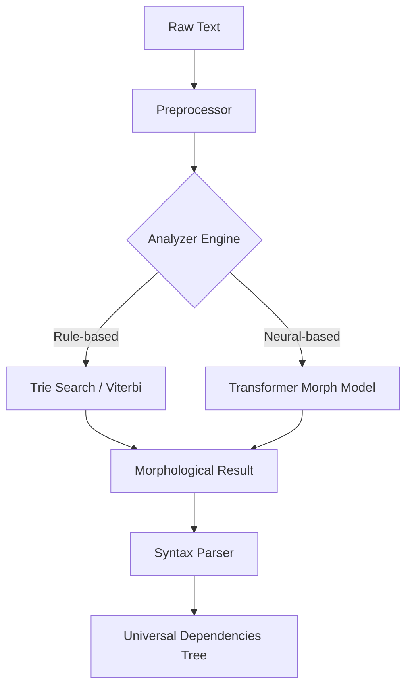

# KULIM Grammar

<p align="center">
  
  
  
  <a href="README.en.md"></a>
</p>

---

## 개요 (Overview)

**KULIM Grammar**는 KULIM 프레임워크의 핵심 분석 엔진입니다.
규칙 기반(Rule-based) 엔진의 정밀함과 신경망(Neural) 모델의 유연성을 결합한 하이브리드 아키텍처를 통해, 한국어 형태소 분석 및 의존 구문 분석에서 타협 없는 성능을 제공합니다.

### 왜 Grammar인가?

- **Hybrid Tagging**: Viterbi 알고리즘과 Transformer 모델을 결합하여 미등록 단어(OOV)에 강건하면서도 정밀한 태깅을 수행합니다.
- **Extreme Performance**: 핵심 자료구조인 Trie를 Rust로 구현하여 Python 모듈 대비 약 10~50배의 검색 속도를 확보했습니다.
- **Production Ready**: 예외 처리 강화와 표준 로깅 시스템 도입으로 엔터프라이즈 환경에서의 안정성을 보장합니다.

---

## 시스템 아키텍처 (Architecture)



---

## 설치 가이드 (Installation)

```bash
# KULIM 통합 패키지 설치
pip install kulim

# GPU 가속이 필요한 경우 (CUDA 12.x 기준)
pip install cupy-cuda12x
```

> [!TIP]
> 최상의 성능을 위해 [Rust 확장 모듈](rust/)을 직접 빌드하여 사용하는 것을 권장합니다.

---

## CLI 도구 사용법 (Command Line Interface)

KULIM Grammar는 직관적인 CLI 명령어를 제공합니다.

### 1. 문장 분석 (Analyze)
```bash
# 기본 분석 명령
uv run grammar analyze "오늘 날씨가 정말 좋네요."

# 모든 가속화 옵션 적용
uv run grammar analyze "반갑습니다" --rust --neural --gpu
```

### 2. 모델 학습 (Train)
```bash
# CoNLL-U 말뭉치를 이용한 엔진 학습
uv run grammar train ./corpus_data/ --epochs 10 --batch-size 32
```

---

## API 레퍼런스 (API Reference)

### `MorphAnalyzer`

형태소 분석을 담당하는 메인 인터페이스입니다.

| Method | Description |
| :--- | :--- |
| `analyze(text)` | 텍스트를 분석하여 `Morph` 객체 리스트를 반환합니다. |
| `train(sentence, morphs)` | 특정 문장에 대한 분석 결과를 실시간으로 모델에 반영합니다. |
| `save()` | 학습된 사전 및 모델 가중치를 영구 저장합니다. |

### `SyntaxAnalyzer`

의존 구문 분석 및 문장 성분 판별을 수행합니다.

| Method | Description |
| :--- | :--- |
| `analyze(text, morph_analyzer)` | 문장 내부의 지배-종속 관계를 분석하여 성분을 추출합니다. |

---

## 트러블슈팅 (Troubleshooting)

| Error | Cause | Solution |
| :--- | :--- | :--- |
| `DictionaryError` | 사전 데이터 경로를 찾을 수 없음 | `KULIM_DATA_DIR` 환경 변수를 확인하세요. |
| `ModelLoadError` | 신경망 모델 파일(.pt) 로드 실패 | 모델 경로 및 파일 무결성을 점검하세요. |
| `RustExtensionError` | 빌드된 이진 형식(Binary) 불일치 | `maturin develop`를 통해 로컬 환경에서 재빌드하세요. |

---

## 라이선스 (License)

본 모듈은 [MIT License](../../LICENSE)에 따라 배포됩니다.
공헌 및 버그 제보는 [GitHub Issues](https://github.com/jake1104/KULIM/issues)를 이용해 주시기 바랍니다.
